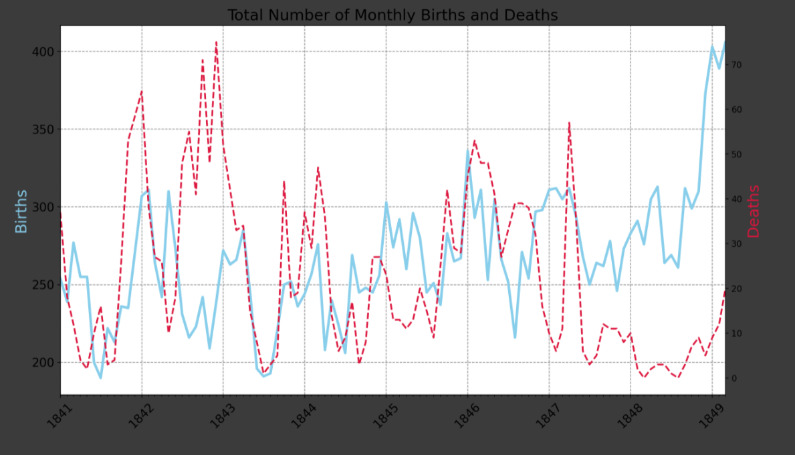
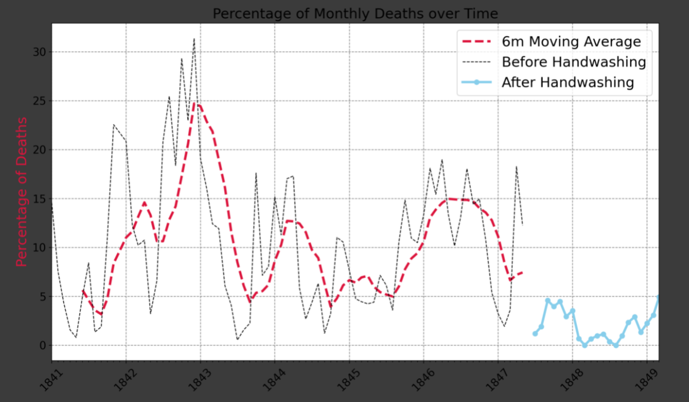
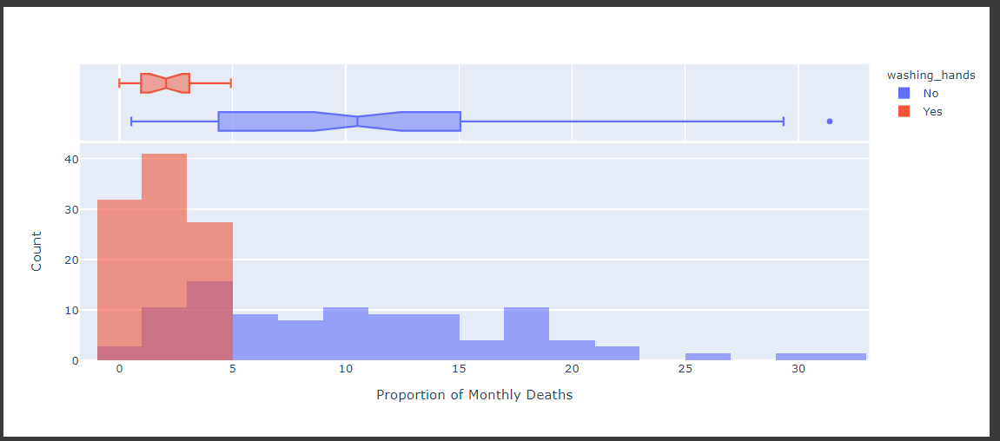
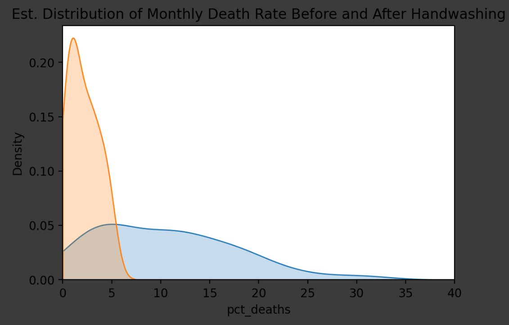

# DataAnalys_Handwash
t-Tests and distributions.

## Table of contents
* [General info](#general-info)
* [Screenshots](#screenshots)
* [Technologies](#technologies)
* [Setup](#setup)
* [Status](#status)

## General info
It is one of the Data Analysing projects which is suppoused to hone my skills in that category.

Main goals of the project were:
* How to use histograms to visualise distributions.
* How to superimpose histograms on top of each other.
* How to use a to smooth out kinks in a histogram and visualise a distribution with a Kernel Density Estimate (KDE).
* How to use scipy and test for statistical significance by looking at p-values.

As a notebook I used Datalore from Jetbrains.

It's one of the projects from [Angela's Python Bootcamp](https://www.udemy.com/course/100-days-of-code/)

## Screenshots

## Technologies
* Python 3.8
* Pandas 1.3.3
* Matplotlib 3.4.3
* Seaborn 0.11.2

## Setup
Import notebook and data from csv file into one of the Data Science Notebooks (f.e. Datalore).

## Status
Project is: _finished_.
